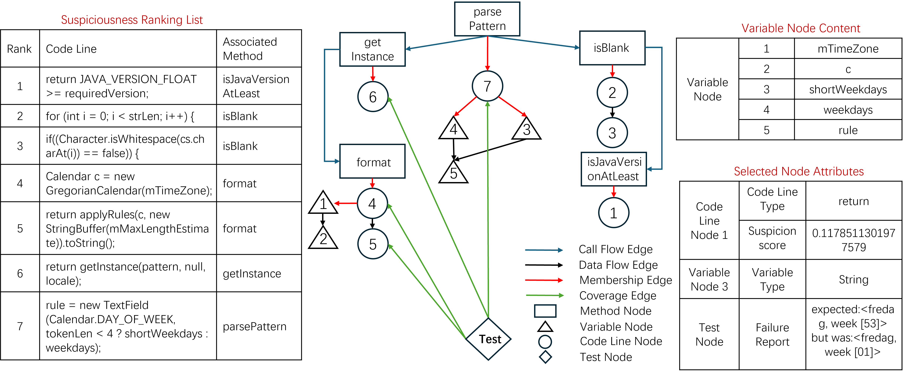
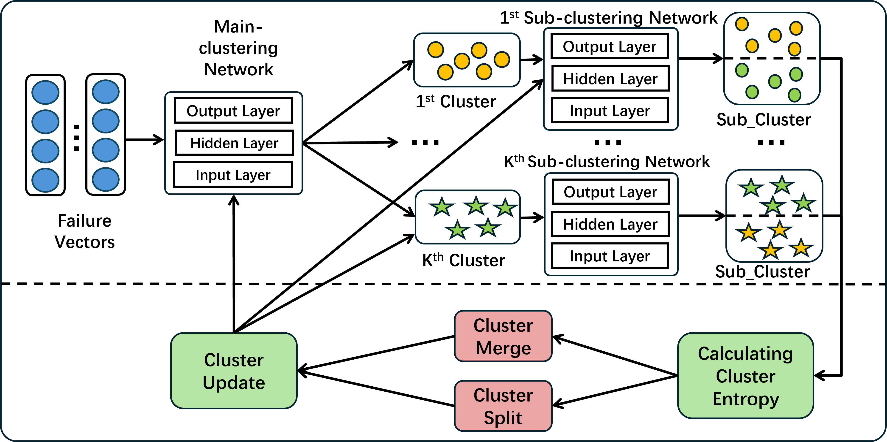

# GREClue

A PyTorch Implementation of FSE submission "GREClue: Failure Indexing with Graph-based Failure Representation and Entropy-based Deep Clustering".

## Introduction

Failure indexing aims to group multiple failures according to their root causes and is an essential step in parallel debugging. Failure indexing consists mainly of two steps: failure representation and failure clustering. While many research efforts have been devoted to these two steps, serious issues still exist. For failure representation, existing works use coverage or program memory information, which unfortunately can not capture deep failure semantic. For failure clustering, advanced failure indexing methods use clustering algorithms with preset cluster centers, but this kind of clustering algorithm can handle circular clusters well but performs poorly when handling clusters of other shapes. To address these issues, this paper propose GREClue, a novel failure indexing approach with Graph-based failure Representation and Entropy-based deep Clustering. GREClue overcomes the issues in order. For failure representation, GREClue designs the failure semantic graph (FSG), a new graph representation that effectively contains semantic information and runtime information of failures.

<div align=center></div>
Based on the FSG, GREClue further consists of an entropy-based deep clustering component, which can accurately cluster failed tests without presetting cluster centers. An extensive evaluation has been conducted to evaluate GREClue, and the results show that compared to the state-of-the-art failure indexing method, GREClue improves both the performance of estimating the number of faults and the clustering effectiveness by 10% to 41%. Moreover, it has also been shown that GREClue can effectively facilitate parallel debugging.
<div align=center></div>

## Folder Structure

Here we list the descriptions of the folders:


* FSG: the code for FSG.
     * FSG/Defects4J-Multifault: the code for generating FSGs for Java programs in Defects4J-Multifault.
     * FSG/SIR: the code for generating FSGs for C programs in SIR.
* Entropy-based_clustering: the code for Entropy-based clustering.
* Ablation_study: the code for Ablation_study.
     * GREClue-Suspicion_List: the code for GREClue without FSGs.
     * GREClue-K-medoids: the code for K-medoids (implementation using the [pyclustering package](https://pyclustering.github.io/docs/0.10.1/html/de/dfd/namespacepyclustering_1_1cluster_1_1kmedoids.html)) with suspiciousness ranking lists and FSGs.
     * GREClue-RMALL: the code for K-medoids (implementation using the [pyclustering package](https://pyclustering.github.io/docs/0.10.1/html/de/dfd/namespacepyclustering_1_1cluster_1_1kmedoids.html)) without FSGs.


## Requirements

* Conda
  * install conda: Please refer to the [conda official website](https://conda.io/projects/conda/en/latest/user-guide/install/index.html).
  * Create a new conda environment:
    * if you are running with GPU:
      ```
      conda env create -f environment-gpu.yml
      conda activate GREClue
      ```

      Dependencies include support for CUDA_11.4. If you are using a different CUDA version, update the dependencies accordingly.
    * if you are running with CPU:
      ```
      conda env create -f environment-cpu.yml
      conda activate GREClue
      ```
* Dependency
  * Python >= 3.8
  * Pytorch >= 1.5.0
  * Transformers>=4.10.0
  * tree_sitter
  * Numpy
  * Scikit-learn
  * pathlib

## Datasets

We conducted experiments using two widely used datasets in the failure indexing field, including Defects4J-Multifault and SIR datasets.

* Defects4J-Multifault dataset is obtained from https://github.com/SURE-Repo/SURE/tree/main/Faulty_Program/Defects4J.

  * Defects4J-Multifault contains five Java projects from [Defects4J](https://github.com/rjust/defects4j): *Chart*, *Closure*, *Lang*, *Math*, and *Time*. The dataset is generated by searching for 1-bug, 2-bug, 3-bug, 4-bug, and 5-bug faulty versions. The specific search strategy is as follows:

    `"Searching for Multi-Fault Programs in Defects4J", Gabin An, Juyeon Yoon, Shin Yoo, SSBSE 2021`

    Please refer to the [tool link](https://github.com/coinse/Defects4J-multifault) for specific operations.
* SIR dataset is obtained from https://github.com/SURE-Repo/SURE/tree/main/Faulty_Program/SIR.

  * SIR dataset contains four C projects from [SIR](https://sir.csc.ncsu.edu/portal/index.php): *flex*, *grep*, *gzip*, and *sed*. Then, faulty versions with 1-bug, 2-bug, 3-bug, 4-bug, and 5-bug were created based on a mutation strategy. The mutation strategy refers to an existing tool [yisongy/mutate.py](https://github.com/yisongy/mutate.py) (This is a simple script to perform mutation testing on c/c++ like programs) to perform mutations.

## A Guide to Replication

Our evaluation is performed on an Ubuntu 22.04.5 server equipped with two RTX A6000 GPUs.

### RQ1 Parameter Analysis

We studied the impact of different selection ranges of the suspiciousness ranking lists on the results.

(1) We first obtain the suspiciousness ranking lists using the fault localization technique [Dstar](https://ieeexplore.ieee.org/abstract/document/6651713):

* For Java programs in Defects4J-Multifault,  we use the tool Gzoltar to obtain the suspiciousness ranking lists.

  Please refer to the [tool link](https://github.com/Instein98/D4jOchiai) for specific operations.
* For C programs in SIR,  we first use the tool Gcov to obtain the coverage information and then implement the Dstar fault localization formula to obtain the suspiciousness ranking lists.

  Please refer to the [tool link](https://sir.csc.ncsu.edu/content/c-overall.php) for specific operations.

(2) We select different ranges of content from the suspiciousness ranking lists to feed the GREClue model and observe the model results:

```
python range.py /path/to/dir --head ranges_of_content --out /path/to/outdir
```
The parameter *ranges_of_content* can be arbitrary values, and our study explores the values of 10, 50, 100, 200, ALL(*i.e.*, all of the statements with suspiciousness scores larger than 0)
### RQ2 Model Effectiveness

After determining the range of the suspiciousness ranking lists, we need to obtain the FSG for the faulty code.

We generate FSG for Defects4J-Multifault faulty code using the following command:

```
python /FSG/Defects4J-Multifault/step1.py   --project /path/of/java/projects   --locs /path/of/suspiciousnesslist.csv   --output /path/of/method_graph.txt
python /FSG/Defects4J-Multifault/step2.py   --project /path/of/java/projects   --locs /path/of/suspiciousnesslist.csv  --codeline_dir /path/to/codeline_dir --output /path/of/codeline_graph.txt
javac /FSG/Defects4J-Multifault/step3/semanticmodel/Activator.java --input /path/to/codeline_dir --output /path/to/var_graph
python /FSG/Defects4J-Multifault/step4.py   --method_graph /path/to/method_graph.txt   --codeline_flow /path/to/codeline_graph.txt   --var_dir /path/to/var_graph   --testfile /path/to/testcov.txt   --output /path/to/merged.txt
```

We generate FSG for SIR faulty code using the following command:

```
python /FSG/SIR/step1.py   --project /path/of/C/projects   --locs /path/of/suspiciousnesslist.csv   --output /path/to/method_graph.txt
python /FSG/SIR/step2.py   --project /path/of/C/projects   --locs /path/of/suspiciousnesslist.csv  --codeline_dir /path/to/codeline_dir --output /path/to/codeline_graph.txt
python /FSG/SIR/step3.py   --in_dir /path/to/codeline_dir --out_dir /path/to/var_graph
python /FSG/SIR/step4.py   --method_graph /path/to/method_graph.txt   --codeline_flow /path/to/codeline_graph.txt   --var_dir /path/to/var_graph   --testfile /path/to/testcov.txt   --output /path/to/merged.txt
```
The four steps for obtaining FSGs in Defects4J-Multifault and SIR datasets are the same as follows:

* The first step is to obtain the call flow of the methods that contain the suspicious code lines.

* The second step is to obtain the data flow between suspicious code lines.

* The third step is to obtain the data flow between variables within the suspicious code lines.

* The fourth step integrates the information from the first three steps and adds coverage relationships between the failing test case and the covered code lines.

Based on the obtained FSGs, we train the entropy-based clustering model:

```
python /Entropy_based_clustering/GREClue_code.py
```

After obtaining 30 results corresponding to the 30 random splits of the SIR data into training and testing data (see the submission for more details), we used the *mannwhitneyu()* method in the [*stats* package](https://docs.scipy.org/doc/scipy/reference/stats.html) to perform the Mann-Whitney-Wilcoxon test and the *rank_compare_2indep()* method in the [*nonparametric* package](https://www.statsmodels.org/stable/nonparametric.html#module-statsmodels.nonparametric) to perform the A-test.

### RQ3 Impact Analysis

In the ablation experiment, we start with the full approach, then remove specific parts separately and observe the results after removal.

* (1) GREClue-Suspicion_List: we replace GREClue with GREClue-Suspicion_List, which only inputs the sequence features of suspiciousness ranking lists into the entropy-based deep clustering model:
```
python /Ablation_study/GREClue-Suspicion_List/GREClue_code.py
```

* (2) GREClue-K-medoids: we replace GREClue with GREClue-K-medoids, which first predicts the number of clusters using the data point density estimation method and then performs clustering using K-medoids:
```
python /Ablation_study/GREClue-K-medoids/pipeline.py --data_dir data --model bigcode/starcoder2-3b --ra 1.0 --rb 1.5
```
* (3) GREClue-RMALL: we replace GREClue with GREClue-RMALL, which removes FSG and entropy-based deep clustering method, and uses K-medoids for clustering:
```
python /Ablation_study/GREClue-RMALL/pipeline.py --data_dir data --model bigcode/starcoder2-3b --ra 1.0 --rb 1.5
```

### RQ4 Parallel Debugging Effectiveness

We simulate the parallel debugging process based on the results of the failure indexing approaches.

(1) cluster the failing tests according to the results of the failure indexing approaches:

```
python /Entropy_based_clustering/GREClue_code.py
```

(2) each cluster of failed tests and all passed tests form the corresponding test suite.

(3) generate a corresponding suspiciousness ranking list for each test suite.

(4) fix the faulty code for each suspiciousness ranking list in parallel and calculate the parallel debugging cost:

```
python debugging_cost.py   --sus /path/of/suspiciousnesslist.csv   --label fixed_code.csv
```
